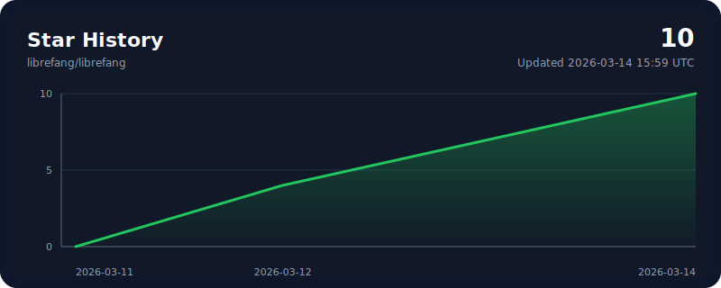

<p align="center">
  
</p>

<h1 align="center">LibreFang</h1>
<h3 align="center">Libre Agent Operating System — Free as in Freedom</h3>

<p align="center">
  Open-source Agent OS built in Rust. 137K LOC. 14 crates. 1,767+ tests. Zero clippy warnings.<br/>
  <strong>Forked from <a href="https://github.com/RightNow-AI/openfang">RightNow-AI/openfang</a>. Truly open governance. Contributors welcome. PRs that help the project get merged.</strong>
</p>

<p align="center">
  <strong>Translations:</strong> <a href="README.md">English</a> | <a href="i18n/README.zh.md">中文</a> | <a href="i18n/README.ja.md">日本語</a> | <a href="i18n/README.ko.md">한국어</a> | <a href="i18n/README.es.md">Español</a> | <a href="i18n/README.de.md">Deutsch</a>
</p>

<p align="center">
  <a href="https://librefang.ai/">Website</a> &bull;
  <a href="https://github.com/librefang/librefang">GitHub</a> &bull;
  <a href="GOVERNANCE.md">Governance</a> &bull;
  <a href="CONTRIBUTING.md">Contributing</a> &bull;
  <a href="SECURITY.md">Security</a>
</p>

<p align="center">
  
  
  
  
  
  
  
  
</p>

<p align="center">
  <a href="https://github.com/librefang/librefang/stargazers">
    
  </a>
</p>

---

> **LibreFang is a community fork of [`RightNow-AI/openfang`](https://github.com/RightNow-AI/openfang).**
>
> **"Libre"** means freedom. We chose this name because we believe an open-source project should be truly open — not just in license, but in governance, contribution, and collaboration. LibreFang is taking a fundamentally different path from the upstream project: we welcome every contributor, review every PR in public, and merge work that benefits the project.

> **Our promise to contributors:**
> - If your PR positively helps the project, **we merge it as-is** with full attribution.
> - If your PR needs improvement, **we actively review it and provide concrete suggestions** to help you get it merged — we don't close PRs silently.
> - Every contributor is valued. Bug fixes, docs, tests, features, packaging, translations — all contributions matter.

---

## What is LibreFang?

LibreFang is an **open-source Agent Operating System** — not a chatbot framework, not a Python wrapper around an LLM, and not a "multi-agent orchestrator." It is a full operating system for autonomous agents, built from scratch in Rust and maintained in the open.

Traditional agent frameworks wait for you to type something. LibreFang runs **autonomous agents that work for you** — on schedules, 24/7, building knowledge graphs, monitoring targets, generating leads, managing your social media, and reporting results to your dashboard.

The project website is live at [librefang.ai](https://librefang.ai/). Today, the fastest way to try LibreFang is still to install from source. The repository does not publish GitHub Releases yet, so the legacy installer scripts are being kept for the first community release.

```bash
cargo install --git https://github.com/librefang/librefang librefang-cli
librefang init
librefang start
# Dashboard live at http://localhost:4545
```

**Or install via Homebrew:**
```bash
brew tap librefang/tap
brew install librefang
```

<details>
<summary><strong>Windows</strong></summary>

```powershell
cargo install --git https://github.com/librefang/librefang librefang-cli
librefang init
librefang start
```

</details>

When LibreFang starts publishing releases, the install commands will be:

```bash
curl -fsSL https://librefang.ai/install.sh | sh
```

```powershell
irm https://librefang.ai/install.ps1 | iex
```

## Why LibreFang? — The Difference from OpenFang

LibreFang was forked from [RightNow-AI/openfang](https://github.com/RightNow-AI/openfang) because we believe in a different way of running an open-source project.

### What "Libre" Means

| | OpenFang | LibreFang |
|---|---------|-----------|
| **License** | MIT | MIT + Apache-2.0 |
| **Governance** | Single-company controlled | Community-governed, transparent decision-making |
| **PR Policy** | At maintainer's discretion | Positive contributions merged as-is; others get active review with improvement suggestions |
| **Attribution** | Not guaranteed | Always preserved in commits and release notes |
| **Contributors** | Limited involvement | Actively welcomed — we need you |
| **Review SLA** | No commitment | Initial response within 7 days |

### Our Commitments

- **Merge-first mindset.** If your PR helps the project move forward, we merge it. No gatekeeping, no "we'll rewrite it internally."
- **Active code review.** PRs that need work get detailed, constructive feedback — not silence. We help you ship.
- **Full attribution.** If a maintainer adapts your patch, your name stays in commit metadata (`Co-authored-by`) and release notes. Closing a PR and re-implementing privately is explicitly prohibited by our [governance](GOVERNANCE.md).
- **Open governance.** Technical decisions happen in issues and PRs, not behind closed doors. See [`GOVERNANCE.md`](GOVERNANCE.md) and [`MAINTAINERS.md`](MAINTAINERS.md).
- **Security first.** Vulnerability reports go through the private process in [`SECURITY.md`](SECURITY.md).
- **Join us.** Active contributors are invited to join the LibreFang GitHub org. Core participants who consistently contribute get commit access and a voice in project direction.

---

## Hands: Agents That Actually Do Things

<p align="center"><em>"Traditional agents wait for you to type. Hands work <strong>for</strong> you."</em></p>

**Hands** are LibreFang's core innovation — pre-built autonomous capability packages that run independently, on schedules, without you having to prompt them. This is not a chatbot. This is an agent that wakes up at 6 AM, researches your competitors, builds a knowledge graph, scores the findings, and delivers a report to your Telegram before you've had coffee.

Each Hand bundles:
- **HAND.toml** — Manifest declaring tools, settings, requirements, and dashboard metrics
- **System Prompt** — Multi-phase operational playbook (not a one-liner — these are 500+ word expert procedures)
- **SKILL.md** — Domain expertise reference injected into context at runtime
- **Guardrails** — Approval gates for sensitive actions (e.g. Browser Hand requires approval before any purchase)

All compiled into the binary. No downloading, no pip install, no Docker pull.

### The 7 Bundled Hands

| Hand | What It Actually Does |
|------|----------------------|
| **Clip** | Takes a YouTube URL, downloads it, identifies the best moments, cuts them into vertical shorts with captions and thumbnails, optionally adds AI voice-over, and publishes to Telegram and WhatsApp. 8-phase pipeline. FFmpeg + yt-dlp + 5 STT backends. |
| **Lead** | Runs daily. Discovers prospects matching your ICP, enriches them with web research, scores 0-100, deduplicates against your existing database, and delivers qualified leads in CSV/JSON/Markdown. Builds ICP profiles over time. |
| **Collector** | OSINT-grade intelligence. You give it a target (company, person, topic). It monitors continuously — change detection, sentiment tracking, knowledge graph construction, and critical alerts when something important shifts. |
| **Predictor** | Superforecasting engine. Collects signals from multiple sources, builds calibrated reasoning chains, makes predictions with confidence intervals, and tracks its own accuracy using Brier scores. Has a contrarian mode that deliberately argues against consensus. |
| **Researcher** | Deep autonomous researcher. Cross-references multiple sources, evaluates credibility using CRAAP criteria (Currency, Relevance, Authority, Accuracy, Purpose), generates cited reports with APA formatting, supports multiple languages. |
| **Twitter** | Autonomous Twitter/X account manager. Creates content in 7 rotating formats, schedules posts for optimal engagement, responds to mentions, tracks performance metrics. Has an approval queue — nothing posts without your OK. |
| **Browser** | Web automation agent. Navigates sites, fills forms, clicks buttons, handles multi-step workflows. Uses Playwright bridge with session persistence. **Mandatory purchase approval gate** — it will never spend your money without explicit confirmation. |

```bash
# Activate the Researcher Hand — it starts working immediately
librefang hand activate researcher

# Check its progress anytime
librefang hand status researcher

# Activate lead generation on a daily schedule
librefang hand activate lead

# Pause without losing state
librefang hand pause lead

# See all available Hands
librefang hand list
```

**Build your own.** Define a `HAND.toml` with tools, settings, and a system prompt. Publish to FangHub.

---

## LibreFang vs The Landscape

<p align="center">
  
</p>

### Benchmarks: Measured, Not Marketed

All data from official documentation and public repositories — February 2026.

#### Cold Start Time (lower is better)

```
ZeroClaw   ██░░░░░░░░░░░░░░░░░░░░░░░░░░░░░░░░░░░░░░   10 ms
LibreFang  ██████░░░░░░░░░░░░░░░░░░░░░░░░░░░░░░░░░░░  180 ms    ★
LangGraph  █████████████████░░░░░░░░░░░░░░░░░░░░░░░░░  2.5 sec
CrewAI     ████████████████████░░░░░░░░░░░░░░░░░░░░░░  3.0 sec
AutoGen    ██████████████████████████░░░░░░░░░░░░░░░░░  4.0 sec
OpenClaw   █████████████████████████████████████████░░  5.98 sec
```

#### Idle Memory Usage (lower is better)

```
ZeroClaw   █░░░░░░░░░░░░░░░░░░░░░░░░░░░░░░░░░░░░░░░░    5 MB
LibreFang  ████░░░░░░░░░░░░░░░░░░░░░░░░░░░░░░░░░░░░░░   40 MB    ★
LangGraph  ██████████████████░░░░░░░░░░░░░░░░░░░░░░░░░  180 MB
CrewAI     ████████████████████░░░░░░░░░░░░░░░░░░░░░░░  200 MB
AutoGen    █████████████████████████░░░░░░░░░░░░░░░░░░  250 MB
OpenClaw   ████████████████████████████████████████░░░░  394 MB
```

#### Install Size (lower is better)

```
ZeroClaw   █░░░░░░░░░░░░░░░░░░░░░░░░░░░░░░░░░░░░░░░░  8.8 MB
LibreFang  ███░░░░░░░░░░░░░░░░░░░░░░░░░░░░░░░░░░░░░░░   32 MB    ★
CrewAI     ████████░░░░░░░░░░░░░░░░░░░░░░░░░░░░░░░░░░  100 MB
LangGraph  ████████████░░░░░░░░░░░░░░░░░░░░░░░░░░░░░░  150 MB
AutoGen    ████████████████░░░░░░░░░░░░░░░░░░░░░░░░░░░  200 MB
OpenClaw   ████████████████████████████████████████░░░░  500 MB
```

#### Security Systems (higher is better)

```
LibreFang  ████████████████████████████████████████████   16      ★
ZeroClaw   ███████████████░░░░░░░░░░░░░░░░░░░░░░░░░░░░    6
OpenClaw   ████████░░░░░░░░░░░░░░░░░░░░░░░░░░░░░░░░░░░    3
AutoGen    █████░░░░░░░░░░░░░░░░░░░░░░░░░░░░░░░░░░░░░░    2
LangGraph  █████░░░░░░░░░░░░░░░░░░░░░░░░░░░░░░░░░░░░░░    2
CrewAI     ███░░░░░░░░░░░░░░░░░░░░░░░░░░░░░░░░░░░░░░░░    1
```

#### Channel Adapters (higher is better)

```
LibreFang  ████████████████████████████████████████████   40      ★
ZeroClaw   ███████████████░░░░░░░░░░░░░░░░░░░░░░░░░░░░   15
OpenClaw   █████████████░░░░░░░░░░░░░░░░░░░░░░░░░░░░░░   13
CrewAI     ░░░░░░░░░░░░░░░░░░░░░░░░░░░░░░░░░░░░░░░░░░    0
AutoGen    ░░░░░░░░░░░░░░░░░░░░░░░░░░░░░░░░░░░░░░░░░░    0
LangGraph  ░░░░░░░░░░░░░░░░░░░░░░░░░░░░░░░░░░░░░░░░░░    0
```

#### LLM Providers (higher is better)

```
ZeroClaw   ████████████████████████████████████████████   28
LibreFang  ██████████████████████████████████████████░░   27      ★
LangGraph  ██████████████████████░░░░░░░░░░░░░░░░░░░░░   15
CrewAI     ██████████████░░░░░░░░░░░░░░░░░░░░░░░░░░░░░   10
OpenClaw   ██████████████░░░░░░░░░░░░░░░░░░░░░░░░░░░░░   10
AutoGen    ███████████░░░░░░░░░░░░░░░░░░░░░░░░░░░░░░░░    8
```

### Feature-by-Feature Comparison

| Feature | LibreFang | OpenClaw | ZeroClaw | CrewAI | AutoGen | LangGraph |
|---------|----------|----------|----------|--------|---------|-----------|
| **Language** | **Rust** | TypeScript | **Rust** | Python | Python | Python |
| **Autonomous Hands** | **7 built-in** | None | None | None | None | None |
| **Security Layers** | **16 discrete** | 3 basic | 6 layers | 1 basic | Docker | AES enc. |
| **Agent Sandbox** | **WASM dual-metered** | None | Allowlists | None | Docker | None |
| **Channel Adapters** | **40** | 13 | 15 | 0 | 0 | 0 |
| **Built-in Tools** | **53 + MCP + A2A** | 50+ | 12 | Plugins | MCP | LC tools |
| **Memory** | **SQLite + vector** | File-based | SQLite FTS5 | 4-layer | External | Checkpoints |
| **Desktop App** | **Tauri 2.0** | None | None | None | Studio | None |
| **Audit Trail** | **Merkle hash-chain** | Logs | Logs | Tracing | Logs | Checkpoints |
| **Cold Start** | **<200ms** | ~6s | ~10ms | ~3s | ~4s | ~2.5s |
| **Install Size** | **~32 MB** | ~500 MB | ~8.8 MB | ~100 MB | ~200 MB | ~150 MB |
| **License** | MIT | MIT | MIT | MIT | MIT | MIT |

---

## 16 Security Systems — Defense in Depth

LibreFang doesn't bolt security on after the fact. Every layer is independently testable and operates without a single point of failure.

| # | System | What It Does |
|---|--------|-------------|
| 1 | **WASM Dual-Metered Sandbox** | Tool code runs in WebAssembly with fuel metering + epoch interruption. A watchdog thread kills runaway code. |
| 2 | **Merkle Hash-Chain Audit Trail** | Every action is cryptographically linked to the previous one. Tamper with one entry and the entire chain breaks. |
| 3 | **Information Flow Taint Tracking** | Labels propagate through execution — secrets are tracked from source to sink. |
| 4 | **Ed25519 Signed Agent Manifests** | Every agent identity and capability set is cryptographically signed. |
| 5 | **SSRF Protection** | Blocks private IPs, cloud metadata endpoints, and DNS rebinding attacks. |
| 6 | **Secret Zeroization** | `Zeroizing<String>` auto-wipes API keys from memory the instant they're no longer needed. |
| 7 | **OFP Mutual Authentication** | HMAC-SHA256 nonce-based, constant-time verification for P2P networking. |
| 8 | **Capability Gates** | Role-based access control — agents declare required tools, the kernel enforces it. |
| 9 | **Security Headers** | CSP, X-Frame-Options, HSTS, X-Content-Type-Options on every response. |
| 10 | **Health Endpoint Redaction** | Public health check returns minimal info. Full diagnostics require authentication. |
| 11 | **Subprocess Sandbox** | `env_clear()` + selective variable passthrough. Process tree isolation with cross-platform kill. |
| 12 | **Prompt Injection Scanner** | Detects override attempts, data exfiltration patterns, and shell reference injection in skills. |
| 13 | **Loop Guard** | SHA256-based tool call loop detection with circuit breaker. Handles ping-pong patterns. |
| 14 | **Session Repair** | 7-phase message history validation and automatic recovery from corruption. |
| 15 | **Path Traversal Prevention** | Canonicalization with symlink escape prevention. `../` doesn't work here. |
| 16 | **GCRA Rate Limiter** | Cost-aware token bucket rate limiting with per-IP tracking and stale cleanup. |

---

## Architecture

14 Rust crates. 137,728 lines of code. Modular kernel design.

```
librefang-kernel      Orchestration, workflows, metering, RBAC, scheduler, budget tracking
librefang-runtime     Agent loop, 3 LLM drivers, 53 tools, WASM sandbox, MCP, A2A
librefang-api         140+ REST/WS/SSE endpoints, OpenAI-compatible API, dashboard
librefang-channels    40 messaging adapters with rate limiting, DM/group policies
librefang-memory      SQLite persistence, vector embeddings, canonical sessions, compaction
librefang-types       Core types, taint tracking, Ed25519 manifest signing, model catalog
librefang-skills      60 bundled skills, SKILL.md parser, FangHub marketplace
librefang-hands       7 autonomous Hands, HAND.toml parser, lifecycle management
librefang-extensions  25 MCP templates, AES-256-GCM credential vault, OAuth2 PKCE
librefang-wire        OFP P2P protocol with HMAC-SHA256 mutual authentication
librefang-cli         CLI with daemon management, TUI dashboard, MCP server mode
librefang-desktop     Tauri 2.0 native app (system tray, notifications, global shortcuts)
librefang-migrate     OpenClaw, LangChain, AutoGPT migration engine
xtask                Build automation
```

---

## 40 Channel Adapters

Connect your agents to every platform your users are on.

**Core:** Telegram, Discord, Slack, WhatsApp, Signal, Matrix, Email (IMAP/SMTP)
**Enterprise:** Microsoft Teams, Mattermost, Google Chat, Webex, Feishu/Lark, Zulip
**Social:** LINE, Viber, Facebook Messenger, Mastodon, Bluesky, Reddit, LinkedIn, Twitch
**Community:** IRC, XMPP, Guilded, Revolt, Keybase, Discourse, Gitter
**Privacy:** Threema, Nostr, Mumble, Nextcloud Talk, Rocket.Chat, Ntfy, Gotify
**Workplace:** Pumble, Flock, Twist, DingTalk, Zalo, Webhooks

Each adapter supports per-channel model overrides, DM/group policies, rate limiting, and output formatting.

---

## 27 LLM Providers — 123+ Models

3 native drivers (Anthropic, Gemini, OpenAI-compatible) route to 27 providers:

Anthropic, Gemini, OpenAI, Groq, DeepSeek, OpenRouter, Together, Mistral, Fireworks, Cohere, Perplexity, xAI, AI21, Cerebras, SambaNova, HuggingFace, Replicate, Ollama, vLLM, LM Studio, Qwen, MiniMax, Zhipu, Moonshot, Qianfan, Bedrock, and more.

Intelligent routing with task complexity scoring, automatic fallback, cost tracking, and per-model pricing.

---

## Migrate from OpenClaw

Already running OpenClaw? One command:

```bash
# Migrate everything — agents, memory, skills, configs
librefang migrate --from openclaw

# Migrate from a specific path
librefang migrate --from openclaw --path ~/.openclaw

# Dry run first to see what would change
librefang migrate --from openclaw --dry-run
```

The migration engine imports your agents, conversation history, skills, and configuration. LibreFang reads SKILL.md natively and is compatible with the ClawHub marketplace.

---

## OpenAI-Compatible API

Drop-in replacement. Point your existing tools at LibreFang:

```bash
curl -X POST localhost:4545/v1/chat/completions \
  -H "Content-Type: application/json" \
  -d '{
    "model": "researcher",
    "messages": [{"role": "user", "content": "Analyze Q4 market trends"}],
    "stream": true
  }'
```

140+ REST/WS/SSE endpoints covering agents, memory, workflows, channels, models, skills, A2A, Hands, and more.

---

## Quick Start

```bash
# 1. Install
cargo install --git https://github.com/librefang/librefang librefang-cli

# 2. Initialize — walks you through provider setup
librefang init

# 3. Start the daemon
librefang start

# 4. Dashboard is live at http://localhost:4545

# 5. Activate a Hand — it starts working for you
librefang hand activate researcher

# 6. Chat with an agent
librefang chat researcher
> "What are the emerging trends in AI agent frameworks?"

# 7. Spawn a pre-built agent
librefang agent spawn coder
```

<details>
<summary><strong>Windows (PowerShell)</strong></summary>

```powershell
cargo install --git https://github.com/librefang/librefang librefang-cli
librefang init
librefang start
```

</details>

---

## Development

```bash
# Build the workspace
cargo build --workspace --lib

# Run all tests (1,767+)
cargo test --workspace

# Lint (must be 0 warnings)
cargo clippy --workspace --all-targets -- -D warnings

# Format
cargo fmt --all -- --check
```

---

## Stability Notice

LibreFang is pre-1.0. The architecture is solid, the test suite is comprehensive, and the security model is comprehensive. That said:

- **Breaking changes** may occur between minor versions until v1.0
- **Some Hands** are more mature than others (Browser and Researcher are the most battle-tested)
- **Edge cases** exist — if you find one, [open an issue](https://github.com/librefang/librefang/issues)
- **Pin to a specific commit** for production deployments until v1.0

We ship fast and fix fast. The goal is a rock-solid v1.0 by mid-2026.

---

## Security

To report a security vulnerability, follow the private reporting process in [SECURITY.md](SECURITY.md).

---

## License

MIT License. See the LICENSE file for details.

---

## Links

- [GitHub](https://github.com/librefang/librefang)
- [Website](https://librefang.ai/)
- [Documentation](https://docs.librefang.ai)
- [API Reference](docs/api-reference.md)
- [Contributing Guide](CONTRIBUTING.md)
- [Governance](GOVERNANCE.md)
- [Maintainers](MAINTAINERS.md)
- [Security Policy](SECURITY.md)

---

<p align="center">
  <strong>Built with Rust. Secured with 16 layers. Agents that actually work for you.</strong>
</p>
