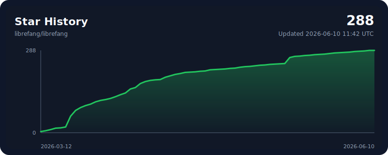

<p align="center">
  
</p>

<h1 align="center">LibreFang</h1>
<h3 align="center">自由なエージェントオペレーティングシステム — Libre は自由を意味する</h3>

<p align="center">
  Rust で構築されたオープンソース Agent OS。14 クレート。2,100+ テスト。clippy 警告ゼロ。
</p>

<p align="center">
  <a href="../README.md">English</a> | <a href="README.zh.md">中文</a> | <a href="README.ja.md">日本語</a> | <a href="README.ko.md">한국어</a> | <a href="README.es.md">Español</a> | <a href="README.de.md">Deutsch</a> | <a href="README.pl.md">Polski</a>
</p>

<p align="center">
  <a href="https://librefang.ai/">ウェブサイト</a> &bull;
  <a href="https://docs.librefang.ai">ドキュメント</a> &bull;
  <a href="../CONTRIBUTING.md">コントリビュート</a> &bull;
  <a href="https://discord.gg/DzTYqAZZmc">Discord</a>
</p>

<p align="center">
  <a href="https://github.com/librefang/librefang/actions/workflows/ci.yml"></a>
  
  
  
  
  <a href="https://discord.gg/DzTYqAZZmc"></a>
  <a href="https://deepwiki.com/librefang/librefang"></a>
</p>

---

## LibreFang とは？

LibreFang は **エージェントオペレーティングシステム** — Rust でゼロから構築された、自律型 AI エージェントを実行するための完全なプラットフォームです。チャットボットフレームワークでも、Python ラッパーでもありません。

従来のエージェントフレームワークは入力を待ちます。LibreFang は**あなたのために働くエージェント**を実行します — スケジュールに従い、24時間365日、ターゲットの監視、リード生成、ソーシャルメディア管理、ダッシュボードへのレポートを行います。

> LibreFang は [`RightNow-AI/openfang`](https://github.com/RightNow-AI/openfang) のコミュニティフォークで、オープンガバナンスとマージファーストの PR ポリシーを採用しています。詳細は [GOVERNANCE.md](../GOVERNANCE.md) を参照。

<p align="center">
  
</p>

## クイックスタート

```bash
# インストール (Linux/macOS/WSL)
curl -fsSL https://librefang.ai/install.sh | sh

# または Cargo でインストール
cargo install --git https://github.com/librefang/librefang librefang-cli

# 初期化（プロバイダー設定をガイド）
librefang init

# 起動 — ダッシュボード http://localhost:4545
librefang start
```

<details>
<summary><strong>Homebrew</strong></summary>

```bash
brew tap librefang/tap
brew install librefang              # CLI (stable)
brew install --cask librefang       # Desktop (stable)
# Beta/RC channels also available:
# brew install librefang-beta       # or librefang-rc
# brew install --cask librefang-rc  # or librefang-beta
```

</details>

<details>
<summary><strong>Docker</strong></summary>

```bash
docker run -p 4545:4545 ghcr.io/librefang/librefang
```

</details>

<details>
<summary><strong>クラウドデプロイ</strong></summary>

[](https://deploy.librefang.ai) [](https://deploy.librefang.ai) [](https://render.com/deploy?repo=https://github.com/librefang/librefang) [](https://railway.app/template/librefang) [](../deploy/gcp/README.md)

</details>

## Hands：あなたのために働くエージェント

**Hands** はプリビルトの自律型機能パッケージで、スケジュールに従い独立して動作します。14 個バンドル：

| Hand | 機能 |
|------|------|
| **Researcher** | 深い調査 — 複数ソースの相互参照、CRAAP 信頼性評価、引用付きレポート |
| **Collector** | OSINT 監視 — 変更検出、感情追跡、ナレッジグラフ |
| **Predictor** | 超予測 — 信頼区間付きのキャリブレーション済み予測 |
| **Strategist** | 戦略分析 — 市場調査、競合インテリジェンス、事業計画 |
| **Analytics** | データ分析 — 収集、分析、可視化、自動レポート |
| **Trader** | 市場インテリジェンス — マルチシグナル分析、リスク管理、ポートフォリオ分析 |
| **Lead** | 見込み客発見 — ウェブ調査、スコアリング、重複排除、リード配信 |
| **Twitter** | 自律型 X/Twitter — コンテンツ作成、スケジューリング、承認キュー |
| **Reddit** | Reddit 管理 — サブレディット監視、投稿、エンゲージメント追跡 |
| **LinkedIn** | LinkedIn 管理 — コンテンツ作成、ネットワーキング、プロフェッショナル交流 |
| **Clip** | YouTube からショート動画 — ベストモーメント切り出し、字幕、AI ナレーション |
| **Browser** | Web 自動化 — Playwright ベース、購入承認ゲート必須 |
| **API Tester** | API テスト — エンドポイント発見、検証、負荷テスト、回帰検出 |
| **DevOps** | DevOps 自動化 — CI/CD、インフラ監視、インシデント対応 |

```bash
librefang hand activate researcher   # すぐに作業開始
librefang hand status researcher     # 進捗確認
librefang hand list                  # 全 Hands を表示
```

独自の Hand を作成: `HAND.toml` + システムプロンプト + `SKILL.md` を定義。[ガイド](https://docs.librefang.ai/agent/skills)

## アーキテクチャ

14 の Rust クレート、モジュラーカーネル設計。

```
librefang-kernel      オーケストレーション、ワークフロー、計量、RBAC、スケジューラ、予算
librefang-runtime     エージェントループ、3 LLM ドライバ、53 ツール、WASM サンドボックス、MCP、A2A
librefang-api         140+ REST/WS/SSE エンドポイント、OpenAI 互換 API、ダッシュボード
librefang-channels    40 メッセージングアダプター、レート制限、DM/グループポリシー
librefang-memory      SQLite 永続化、ベクトル埋め込み、セッション、圧縮
librefang-types       コア型、テイント追跡、Ed25519 署名、モデルカタログ
librefang-skills      60 バンドルスキル、SKILL.md パーサー、FangHub マーケットプレイス
librefang-hands       14 自律 Hands、HAND.toml パーサー、ライフサイクル管理
librefang-extensions  25 MCP テンプレート、AES-256-GCM ボールト、OAuth2 PKCE
librefang-wire        OFP P2P プロトコル、HMAC-SHA256 相互認証
librefang-cli         CLI、デーモン管理、TUI ダッシュボード、MCP サーバーモード
librefang-desktop     Tauri 2.0 ネイティブアプリ（トレイ、通知、ショートカット）
librefang-migrate     OpenClaw、LangChain、AutoGPT マイグレーションエンジン
xtask                 ビルド自動化
```

## 主な機能

**40 チャネルアダプター** — Telegram、Discord、Slack、WhatsApp、Signal、Matrix、Email、Teams、Google Chat、Feishu、LINE、Mastodon、Bluesky 他。[完全リスト](https://docs.librefang.ai/integrations/channels)

**27 LLM プロバイダー** — Anthropic、Gemini、OpenAI、Groq、DeepSeek、OpenRouter、Ollama 他。インテリジェントルーティング、自動フォールバック、コスト追跡。[詳細](https://docs.librefang.ai/configuration/providers)

**16 セキュリティレイヤー** — WASM サンドボックス、Merkle 監査証跡、テイント追跡、Ed25519 署名、SSRF 保護、シークレットゼロ化他。[詳細](https://docs.librefang.ai/getting-started/comparison#16-security-systems--defense-in-depth)

**OpenAI 互換 API** — ドロップインの `/v1/chat/completions` エンドポイント。140+ REST/WS/SSE エンドポイント。[API リファレンス](https://docs.librefang.ai/integrations/api)

**クライアント SDK** — ストリーミング対応の完全な REST クライアント。

```javascript
// JavaScript/TypeScript
npm install @librefang/sdk
const { LibreFang } = require("@librefang/sdk");
const client = new LibreFang("http://localhost:4545");
const agent = await client.agents.create({ template: "assistant" });
const reply = await client.agents.message(agent.id, "Hello!");
```

```python
# Python
pip install librefang
from librefang import Client
client = Client("http://localhost:4545")
agent = client.agents.create(template="assistant")
reply = client.agents.message(agent["id"], "Hello!")
```

```rust
// Rust
cargo add librefang
use librefang::LibreFang;
let client = LibreFang::new("http://localhost:4545");
let agent = client.agents().create(CreateAgentRequest { template: Some("assistant".into()), .. }).await?;
```

```go
// Go
go get github.com/librefang/librefang/sdk/go
import "github.com/librefang/librefang/sdk/go"
client := librefang.New("http://localhost:4545")
agent, _ := client.Agents.Create(map[string]interface{}{"template": "assistant"})
```

**MCP サポート** — MCP クライアントとサーバーを内蔵。IDE 連携、カスタムツール拡張、エージェントパイプライン構築。[詳細](https://docs.librefang.ai/integrations/mcp-a2a)

**A2A プロトコル** — Google Agent-to-Agent プロトコル対応。エージェントシステム間の発見・通信・タスク委譲。[詳細](https://docs.librefang.ai/integrations/mcp-a2a)

**デスクトップアプリ** — Tauri 2.0 ネイティブアプリ。システムトレイ、通知、グローバルショートカット。

**OpenClaw マイグレーション** — `librefang migrate --from openclaw` でエージェント、履歴、スキル、設定をインポート。

## 開発

```bash
cargo build --workspace --lib                            # ビルド
cargo test --workspace                                   # 2,100+ テスト
cargo clippy --workspace --all-targets -- -D warnings    # 警告ゼロ
cargo fmt --all -- --check                               # フォーマットチェック
```

## 比較

[比較](https://docs.librefang.ai/getting-started/comparison#16-security-systems--defense-in-depth) で OpenClaw、ZeroClaw、CrewAI、AutoGen、LangGraph とのベンチマークと機能比較を確認できます。

## リンク

- [ドキュメント](https://docs.librefang.ai) &bull; [API リファレンス](https://docs.librefang.ai/integrations/api) &bull; [入門ガイド](https://docs.librefang.ai/getting-started) &bull; [トラブルシューティング](https://docs.librefang.ai/operations/troubleshooting)
- [コントリビュート](../CONTRIBUTING.md) &bull; [ガバナンス](../GOVERNANCE.md) &bull; [セキュリティ](../SECURITY.md)
- ディスカッション: [Q&A](https://github.com/librefang/librefang/discussions/categories/q-a) &bull; [ユースケース](https://github.com/librefang/librefang/discussions/categories/show-and-tell) &bull; [機能投票](https://github.com/librefang/librefang/discussions/categories/ideas) &bull; [お知らせ](https://github.com/librefang/librefang/discussions/categories/announcements) &bull; [Discord](https://discord.gg/DzTYqAZZmc)

## コントリビューター

<a href="https://github.com/librefang/librefang/graphs/contributors">
  
</a>

<p align="center">
  コード、ドキュメント、翻訳、バグ報告など、あらゆる形の貢献を歓迎します。<br/>
  <a href="../CONTRIBUTING.md">コントリビュートガイド</a>を確認して、<a href="https://github.com/librefang/librefang/issues?q=is%3Aissue+is%3Aopen+label%3A%22good+first+issue%22">good first issue</a> から始めましょう！<br/>
  また、新しいコントリビューター向けの役立つ情報が更新されている<a href="https://leszek3737.github.io/librefang-WIki/">非公式wiki</a>もご覧いただけます。
</p>

<p align="center">
  <a href="https://github.com/librefang/librefang/stargazers">
    
  </a>
</p>

---

<p align="center">MIT ライセンス</p>
